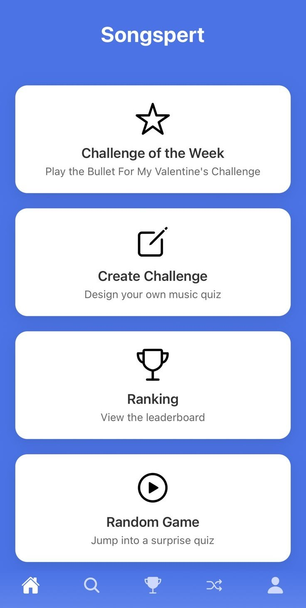

# 🎵 Songspert

**Songspert** é uma aplicação de quizzes musicais interativa e multiplataforma que desafia os usuários a adivinharem músicas ouvindo apenas um trecho do áudio. É possível jogar partidas aleatórias por gênero, criar conjuntos personalizados de desafios e competir no ranking de pontuações.

## 🧩 Estrutura do Projeto

O projeto é composto por três camadas principais:

- 🧠 **Backend**: API REST em [Django](https://www.djangoproject.com/) com integração à [API do Deezer](https://developers.deezer.com/).
- 🌐 **Frontend Web**: Aplicação feita com [Next.js](https://nextjs.org/) (pasta `frontend/`).
- 📱 **App Mobile**: App feito em [React Native](https://reactnative.dev/) com [Expo](https://expo.dev/) (pasta `app/`).


## 📊 Funcionalidades

- 🔍 Quiz aleatório por gênero musical  
- 👥 Criação de conjuntos de desafios personalizados  
- 🏆 Ranking de usuários por pontuação  
- 🎶 Reprodução de trechos musicais via Deezer API  


## 🔧 Tecnologias Utilizadas

- 🎧 Django + Django REST Framework  
- 🎼 API do Deezer  
- ⚙️ React + Next.js  
- ⚛️ React Native + Expo  
- 🐋 Docker + Docker Compose  
- 📈 Swagger/OpenAPI  

---

## 🚀 Execução Rápida com Docker

Certifique-se de ter [Docker](https://www.docker.com/) e [Docker Compose](https://docs.docker.com/compose/) instalados.

```bash
docker-compose up
```

Isso iniciará:

✅ Backend (porta 8000) com a documentação Swagger em: http://localhost:8000/swagger/  
✅ Frontend Web (porta 3000) em: http://localhost:3000


## 📱 Rodando o App Mobile

```bash
cd app
npm install
npx expo start
```

Você pode escanear o QR Code com o app do Expo Go ou rodar em um emulador Android/iOS.


## 🖥️ Rodando Manualmente o Backend

```bash
cd backend
pip install -r requirements.txt
python manage.py migrate
python manage.py runserver
```

Swagger disponível em: http://localhost:8000/swagger/


## 🌍 Rodando Manualmente o Frontend Web

```bash
cd frontend
npm install
npm run dev
```

Acesse via: http://localhost:3000

---

## 🖼️ Preview
Homepage do app.

